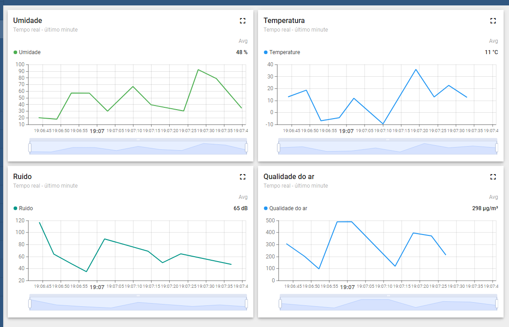

# IoT Cidade Inteligente

## Descrição
Projeto para criação de um ambiente de Internet das Coisas (IoT) distribuído, com 4 dispositivos enviando dados de sensoriamento ambiental para uma aplicação ThingsBoard. Os dados são gerados de forma aleatória, processados e enviado para o ThingsBoards para que possam ser visualizados em um dashboard.



## Estrutura do Projeto
- **Dispositivos:**
  - `sensor1_temperatura.py` - Temperatura
  - `sensor2_umidade.py` - Umidade
  - `sensor3_ruido.py` - Ruído
  - `sensor4_qualidade_ar.py` - Qualidade do Ar

- **Aplicação para visualização dos Dashboards:**
  - ThingsBoard (localhost:8080)

## Como clonar o projeto
```bash
  git clone https://github.com/RicardoMBregalda/iot-cidade-inteligente.git
```
## Como realizar a instalação do projeto (Windows)
Para que o projeto seja funcional, primeiramente deve ser realizado a instalação do Python3 e Docker.
- Link de download do Python3: https://www.python.org/downloads/
- Link de download do Docker: https://docker-docs.uclv.cu/get-docker/

### Instalação da Biblioteca do MQTT
```bash
pip install paho-mqtt
```

### Instalação do ThingsBoard (Windows + Docker)

```bash
docker volume create mytb-data
```
```bash
docker volume create mytb-logs
```
Após a criação dos volumes, deveremos acessar via terminal a `outros_arquivos` e rodar os seguintes comandos:

```bash
docker compose up -d
```
```bash
docker compose logs -f mytb
```
Para acessar o ThingsBoard deverá ser acessado seguinte link: localhost:8080.  

Para acessar o painel adminstrativo deverá ser informado o usuario `tenant@thingsboard.org` com a senha `tenant`.

## Usabilidade

### Criação dos dispositivos
No painel adminstrativo do ThingsBoard deverá ser incluido dispositovos, eles deverão obrigatoriamente ter os nomes da seguinte forma:
- sensor1_temperatura
- sensor2_umidade
- sensor3_ruido
- sensor4_qualidade_ar

### Configuração do Dashboard
Deverá ser acessado no painel adminstrativo a tela de `Dashboards`, nessa tela deverá clicar no `(+)` e clicar em `Importar dashboard`, após isso deve ser selecionado o arquivo `.json` que se encontra em `outros_arquivos\iot_cidades_inteligentes.json`.

Com esse processo será importado o Dashboard criado e poderá ser visualizado os dados que serão enviados.

### Envios dos dados
Para os envios das informações para o ThingsBoard é necessario que seja executado cada um dos arquivos disponbilizados na pasta dos dispositivos.

A execução deverá ser feita usando os seguintes comandos.
- Gerador de informações de temperatura
```bash
py .\dispositivos\sensor1_temperatura\sensor1_temperatura.py  
```
- Gerador de informações de umidade
```bash
py .\dispositivos\sensor2_umidade\sensor2_umidade.py
```
- Gerador de informações de ruido
```bash
py .\dispositivos\sensor3_ruido\sensor3_ruido.py
```
- Gerador de informações de qualidade do ar
```bash
py .\dispositivos\sensor4_qualidade_ar\sensor4_qualidade_ar.py
```


